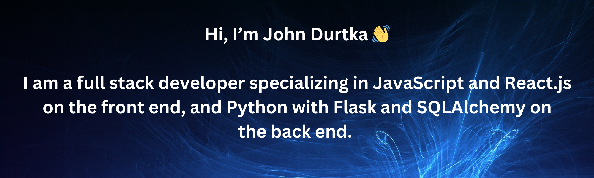

- 📫 How to reach me: johndurtka@gmail.com

- 🔭 I’m currently working on: A personal portfolio website. Also, applying for jobs, including both contract work and permanent positions!

- Projects I like to do for fun: Games! 🎮 I don't actually know any C# or anything though, so it's just been simple stuff so far.

- What do I do for fun? Play games! Lately a lot of Overwatch.

- ⚡ Fun fact: Some of my first experience with programming was actually using ZZT-OOP from the old game ZZT to make game levels with custom code!

- Programming languages: HTML, CSS, JavaScript, Python, Racket, MATLAB
  
- Frameworks: Bootstrap, React, Flask

- Databases: PostgreSQL

- Development Tools: Git, GitHub, VS Code
